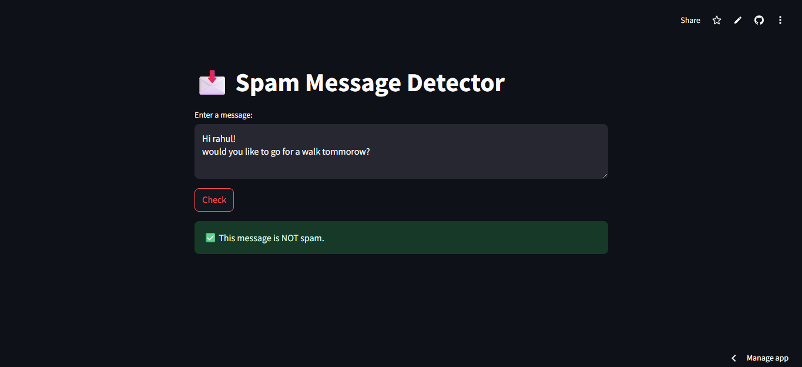
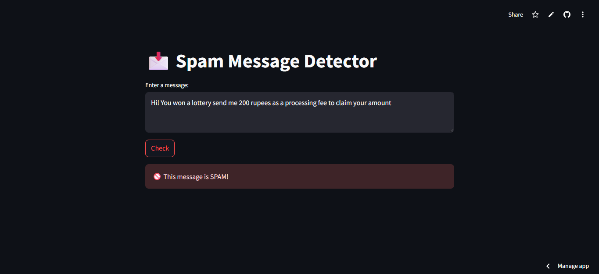

# 📩 Spam Detection Web App using Machine Learning

This project is a web-based application that detects whether a given message is spam or not using a machine learning model. The model is trained using the Naive Bayes algorithm on the SMS Spam Collection Dataset and deployed using Streamlit.

## 🚀 Features
- Takes input of any sentence or paragraph
- Predicts if the message is **Spam** or **Not Spam**
- Trained on real-world SMS spam data
- Clean and simple Streamlit interface

## 🧠 Machine Learning Model
- Model: Multinomial Naive Bayes
- Text Vectorization: CountVectorizer
- Dataset: [UCI SMS Spam Collection Dataset](https://www.kaggle.com/datasets/uciml/sms-spam-collection-dataset)
- Accuracy: ~98% on test data

## 🧪 Example Inputs
### Not Spam (ham)


### SPAM


## 🛠️ Installation

```bash
git clone https://github.com/GAURAV-RAYAT/spam_detection.git
cd spam_detection
pip install -r requirements.txt
streamlit run app.py

```

## Project structure
.
├── app.py                 # Streamlit app
├── train_model.py         # Model training script
├── spam_classifier.pkl    # Trained ML model
├── vectorizer.pkl         # CountVectorizer
├── requirements.txt       # Python dependencies
└── README.md              # Project documentation